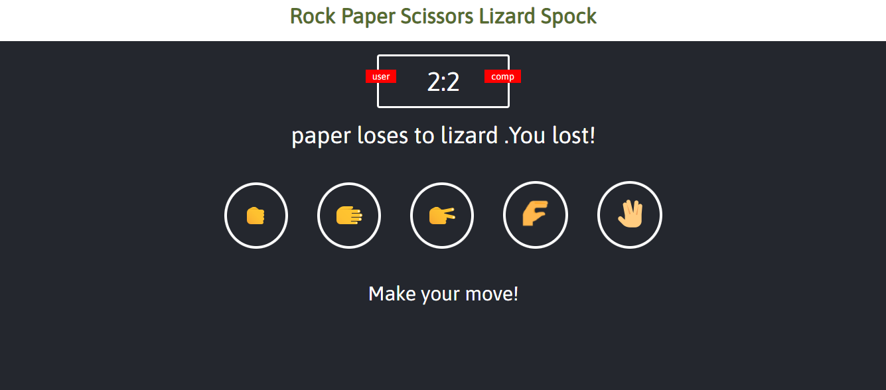
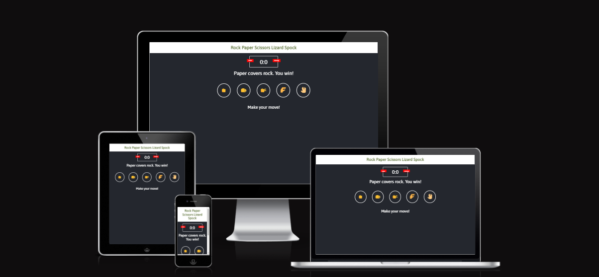
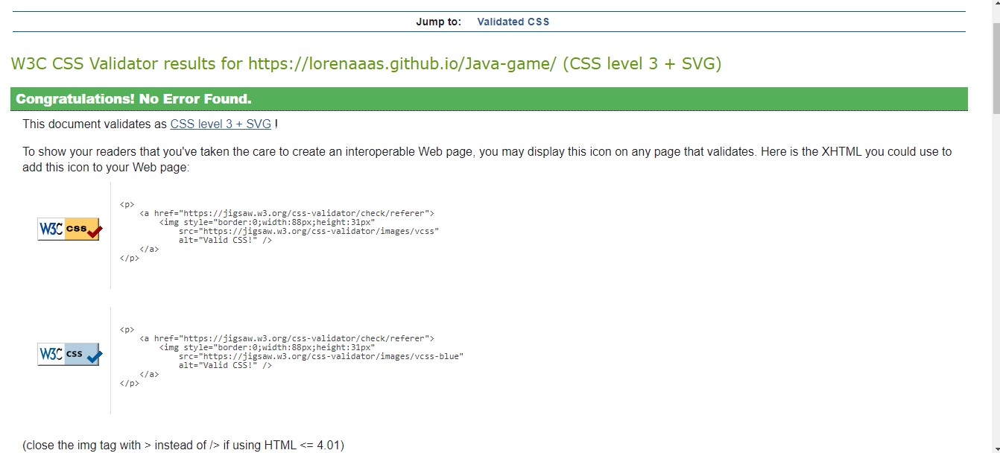
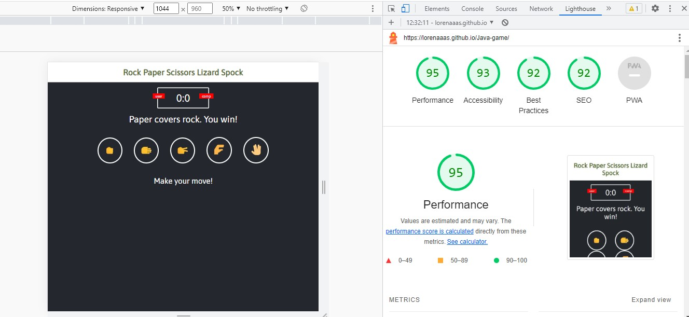

# Rock Paper Scissors Lizard Spock

* Rock Paper Scissors Lizard Spock is a site that tries to demonstrate how  JavaScript works in the real-world context. The site is targeted toward people who not only love to implement more advanced JavaScript concepts but also love to play the “advanced” game of Rock Paper Scissors Lizard Spock.The game is based on the classic Rock Paper Scissors game, but with a twist implemented by the character Sheldon Cooper, from the infamous TV Show”The Big Bang Theory”. It is an entertainment game for users that want to spend some time learning how to play the online game, against the computer.

* The rules of the game are simple and straightforward."Scissors decapitate Scissors cuts paper, paper covers rock, rock crushes lizard, lizard poisons Spock, Spock smashes scissors, scissors decapitates lizard, lizard eats paper, paper disproves Spock, Spock vaporises rock, and as it always has, rock crushes scissors."

# Features
## Existing Features
### The Rock Paper Scissors Lizard Spock Logo and Heading
  * Featured at the top of the page, the heading containing the title “Rock Paper Scissors Lizard Spock” is easy to see for the user. Upon viewing the page, the user will be able to see the name of the game.

   

# The Score Area
* This section displays the score between the user and the computer. It is centred for better viewing and it clearly displays the name ”user” and “computer”.The display is going to change based on who the winner is on every round of the game.

#The recognition area
* This feature has in writing who exactly wins the round of the game. It displays the rules of the game, and the conclusion of either “win”, “loss”, or “tie”.

# The Game Area
   * This section will allow the user to play the game. The user will be able to easily see the hand signal icons defined in circles, for the different characters. They are able to choose one of the hand signals in order to play against the computer.In the moment that they click over one of the hand signals the icon will light up in bright yellow to evidentiate the choice.
  
 
  

  
   # Testing

   ## Validating Testing
  
  ### Page Responsiveness 
    * I confirm that the page is responsive on all screen types when tested on <https://ui.dev/amiresponsive?url=https://lorenaaas.github.io/Java-game/>

    
   ### HTML
     * No errors were returned when passing through the official W3C validator <https://jigsaw.w3.org/css-validator/validator?uri=https%3A%2F%2Florenaaas.github.io%2FJava-game%2F&profile=css3svg&usermedium=all&warning=1&vextwarning=&lang=en>

    

   ### CSS
 
     * No error were found when passing through the official (Jigsaw) validator <https://jigsaw.w3.org/css-validator/validator?uri=https%3A%2F%2Florenaaas.github.io%2FJava-game%2F&profile=css3svg&usermedium=all&warning=1&vextwarning=&lang=en>
     
   

   ### JavaScript

* Metrics
* There are 11 functions in this file.

* Function with the largest signature take 2 arguments, while the median is 0.

* Largest function has 5 statements in it, while the median is 2.

* The most complex function has a cyclomatic complexity value of 22 while the median is 1.

   ### Accessibility

      * I confirm that colour and fonts are easy to read and accessible by running through lighthouse in devtools
       
   

     # Unfixed Bugs

    ## Deployment

      *  The site was deployed to GitHub pages. The steps to deploy are as follows:
    *  In GitHub repository, navigate to the Setting tab
    *  From the source section drop-down menu, select the Master Branch
     *  Once the master branch has been selected, the page will be automatically refreshed with a detailed ribbon display to indicate the successful deployment.
  
     The live link can be found here - add the link of the page <https://lorenaaas.github.io/Java-game/>
     # Credits
   
     ## Content

     * The text for the rules was taken from the https://www.instructables.com/How-to-Play-Rock-Paper-Scissors-Lizard-Spock/
    * The instructions on how to implement form validation on the Sign up page was taken from Specific You tube Tutorial.
    * The icons in were taken from https://icons8.com/
